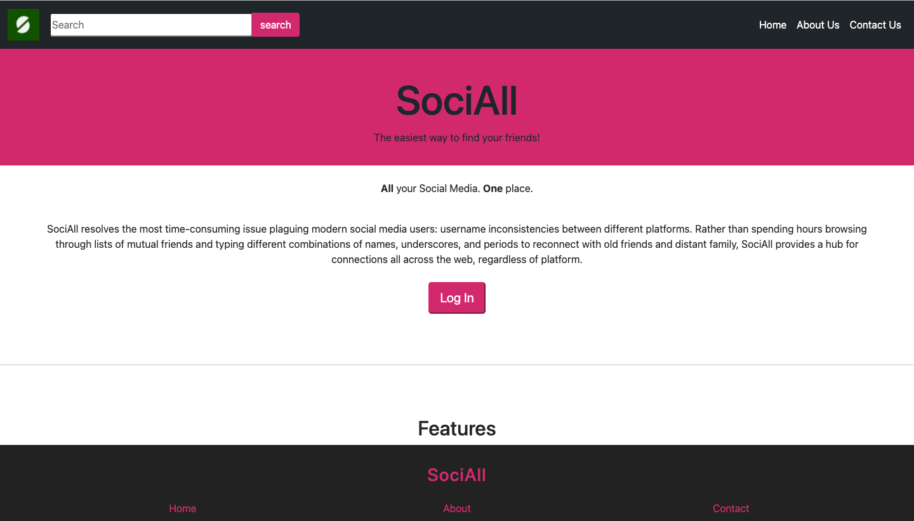
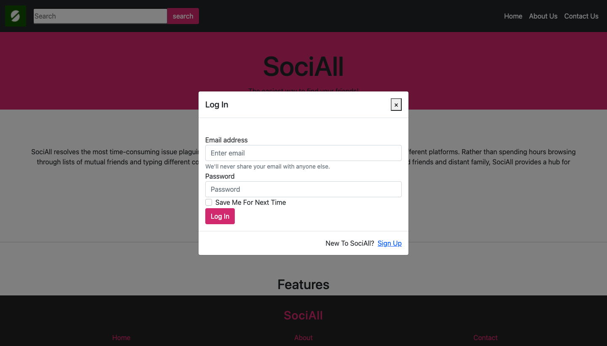

# Implementation

*Group 05 – “[SociAll]”*\
*Date and location: Feb 21, 2021*\
*Group Members: Carter Taylor, Ethan Baranowski, Dakota Battle, Liam Scholl, Max Mosier, Quinn Melssen, William Fuertes*

## 1. Introduction
SociAll is a social media platform that helps to manage the modern day persons’ plethora of social media accounts, all in one place with an intuitive and easy to use interface. Users utilizing SociAll will be able to see all of their friend’s various social media platforms in one place, as well as be able to find them easily using our TextBot, which will respond to SociAll handles with the various information found on that account.

GitHub Repository - [cartertaylor/SociAll: Keychain Web App (github.com)](https://github.com/cartertaylor/SociAll/)
GitHub Project KanBan - [SociAll Task List (github.com)](https://github.com/cartertaylor/SociAll/projects/1)

## 2. Implemented Requirements
The MVP for SociAll is for our website to offer the ability to link the social media accounts of a single person so someone can view all of the social media in one location. The user stories we focused on to achieve this goal was the following:

**As a user of SociAll I want to text a SociAll user name to a number and receive a list of their social media accounts.**\
Quinn has been implementing a Twilio and Python way to have a Textbot to access our database.\
User Story Card:
https://github.com/cartertaylor/SociAll/projects/1#card-57244894

**As a user of SociAll, I want an appealing website/user interface to interact with.**\
Carter, Quinn, Ethan and Dakota have been working on the HTML and CSS side of the website to make it look presentable.\
User Story Card:
https://github.com/cartertaylor/SociAll/projects/1#card-57244880

**As a user of SociAll, I want to see posts from all linked social media pages.**\
William has been working to get the API of Twitter, Instagram and Facebook.\
User Story Card:
https://github.com/cartertaylor/SociAll/projects/1#card-55243192

**As a user I want to be able to view my friends accounts from each platform so I don’t have to look for them over and over.**\
Carter, Liam, and Max have been working with JavaScript, MySQL, and JSON in an attempt to get a database linked to the website.\
User Story Card:
https://github.com/cartertaylor/SociAll/projects/1#card-55243145

**Pull Requests and Cards from the Group:**

Max:
* Initial Setup of MYSQL Database integration 
https://github.com/cartertaylor/SociAll/pull/18
* Fixed the HTML of the Sign up page to utilize database js function 
https://github.com/cartertaylor/SociAll/pull/19

Carter:
* Search bar-> https://github.com/cartertaylor/SociAll/pull/49
* Database addition-> https://github.com/cartertaylor/SociAll/commit/d018b170271657abc56302e72d1490797f9d52bc
* User Profile page-> https://github.com/cartertaylor/SociAll/pull/44

Quinn: 
* https://github.com/cartertaylor/SociAll/pull/52
* https://github.com/cartertaylor/SociAll/pull/57

Dakota:
* Homepage navigation bar consistency across pages ->
https://github.com/cartertaylor/SociAll/pull/41 and 
https://github.com/cartertaylor/SociAll/issues/55
* Wrote and applied the final draft of the display text on homepage ->, also
https://github.com/cartertaylor/SociAll/pull/41                                                          
* About Us Page Creation and Skeleton Creation ->
https://github.com/cartertaylor/SociAll/issues/53
https://github.com/cartertaylor/SociAll/projects/1#card-57244688

Liam: 
* https://github.com/cartertaylor/SociAll/pull/23
* Contributed to the creation of back end on server

William:
* https://github.com/cartertaylor/SociAll/projects/1#card-56237872
* Reaching out to websites for API use

If you want to look at all the things we have here is the done tab:
https://github.com/cartertaylor/SociAll/projects/1#column-12678690

## 3. Adopted Technologies
a. Node - Node JS a backendend JavaScript runtime library to create scalable network applications. We use it as the backend in order to server our website and communicate the front end of our site with our back end.
b. Flask - Flask is the most popular framework for serving python code as web applications. This technology is pertinent for our project as the code for our text bot logic is written in python, and Flask process HTTP requests for the web application, performs the logic, and sends the resulting message to the users.
c. Gunicorn - Gunicorn is a web application deployment software that our project uses to deploy our texting bot web app. It is popularly used in production environments such as ours.
d. Mysql - Node JS module and is a connector that allows you to create databases and tables using sql. We use this as part of the backend of our site in order to store accounts from the client side of our site. 
e. Express - Express JS is a framework and web application of Node JS that gives access to functions to better communicate with our front end and move data back and forth between the two. 

## 4. Learning/training
Much of our learning thus far has begun with a single person or small team of two to three people doing preliminary research to figure out the best solution for our problem. Upon finding a viable solution, said persons seek to increase their own familiarity with the technology via online documentation before implementing it into our system. 

After basic implementation has been established, they present their solution and the working product to the rest of the team, taking up the second half of our meetings. During this time they explain how the technology works, why they chose it, and answer any questions that may arise.

By using this two step method to learning and training, we can better divide roles amongst team members while maintaining a foundational understanding of the system as a whole.

## 5. Deployment
www.Sociall.live, our website, is hosted via HostWinds. Then by SSHing into the provided hostwinds server, we installed Node JS. With Node JS as the main backend to server our site we created a head ‘server.js’ file, to statically serve all of our pages. Then any updates to the code can be implemented by using a FTP tool like FileZilla to include changes.

## 6. Licensing
We believe the GNU GPLv3 license is the simplest and best in our case, for these reasons:\
* Open source per the requirements
* Does not ensure warranties on our part, as well as absolves us of any liabilities related to using the source code
* Ensures no distribution of closed source versions, meaning it will be harder for others to monetize and sell should they want to (as they will have to have their iteration open source as well)
  * MIT allows closed source distribution but is otherwise similar

## 7. Readme File
Our markdown files on our github repository
	
[README](../README.MD)\
[CONTRIBUTION](CONTRIBUTING.md)\
[CODE OF CONDUCT](CODE_OF_CONDUCT.md)\
[LICENSE](LICENSE)\
[TAGGED VERSION](https://github.com/cartertaylor/SociAll/blob/0.3.6/README.MD)

## 8. Look & feel
Our design strives to give the user an easily and upfront view of accessible accounts. The homepage of SociAll also gives a user friendly interface for login/sign up. Additionally, our color scheme is an effort to add a new look on the common “blue” many media platforms have. 

## 9. Lessons learned
Our initial development cycle went well and we were able to get everyone’s environments working and were easily able to implement our code to our web server, which was also simple to set up. There was an initial struggle attempting to get the backend of the server booted up with node.js, but we all contributed to that and have more experience with the backend of a server now and it will likely not cause us any more issues in the future. 

## 10. Demo
Text Bot demo: https://drive.google.com/file/d/1YukpySWPV64pZhOQmcarHkU-taj0QODD/view?usp=sharing

Website Working Demo:
https://drive.google.com/file/d/14_k_RWiP5eYrQm76NLfLP6QBfVZPY1Au/view?usp=sharing
